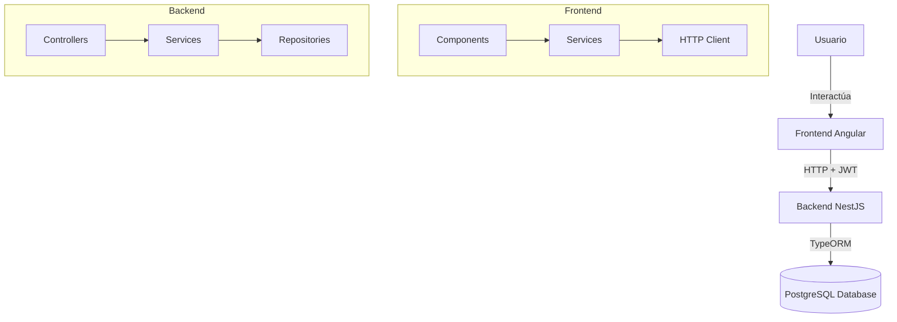
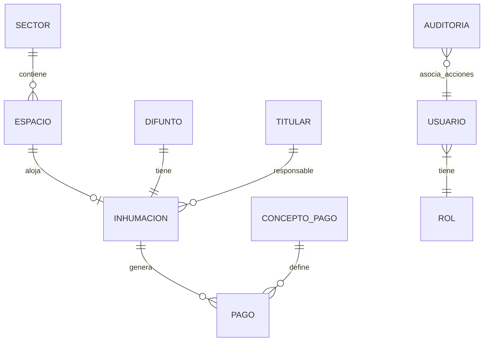

# 🏗️ Arquitectura del Sistema de Cementerio

## Visión General

Sistema full-stack para la gestión integral de cementerios municipales, desarrollado con:
- **Backend**: NestJS + TypeORM + PostgreSQL
- **Frontend**: Angular 19 + PrimeNG + Tailwind CSS

---

## 📁 Estructura del Backend

```
backend/src/
├── main.ts                    # Punto de entrada
├── app.module.ts              # Módulo raíz (Incluye ClsModule)
├── app.controller.ts          # Controller raíz (health checks)
├── app.service.ts             # Servicio raíz (estadísticas dashboard)
│
├── database/                  # 🗄️ Configuración de Base de Datos
│   └── database.module.ts     # Conexión TypeORM a PostgreSQL
│
├── auth/                      # 🔐 Autenticación y Autorización
│   ├── auth.module.ts
│   ├── auth.controller.ts     # Login, registro
│   ├── auth.service.ts        # JWT, validación
│   ├── strategies/            # Passport strategies (Inyecta usuario en CLS)
│   ├── guards/                # JWT Guard, Roles Guard
│   └── decorators/            # @Roles(), @Public()
│
├── infraestructura/           # 🏛️ Gestión de Infraestructura Física
│   ├── infraestructura.module.ts
│   ├── sectores.controller.ts   # CRUD sectores
│   ├── sectores.service.ts
│   ├── espacios.controller.ts   # CRUD espacios/nichos
│   ├── espacios.service.ts      # Incluye mapa visual interactivo (Muro Pabellón)
│   ├── dto/
│   └── entities/
│       ├── sector.entity.ts
│       └── espacio.entity.ts
│
├── registro/                  # 📋 Gestión de Registros (Personas)
│   ├── registro.module.ts
│   ├── difuntos.controller.ts    # CRUD difuntos
│   ├── titulares.controller.ts   # CRUD titulares/responsables (Incluye Estado de Cuenta)
│   ├── inhumaciones.controller.ts # CRUD inhumaciones
│   ├── dto/
│   └── entities/
│       ├── difunto.entity.ts      # Relación 1:1 con Inhumacion
│       ├── titular.entity.ts      # Responsable legal
│       └── inhumacion.entity.ts   # Une Difunto + Espacio + Titular
│
├── caja/                      # 💰 Gestión Financiera
│   ├── caja.module.ts
│   ├── conceptos-pago.controller.ts  # Tipos de cobro
│   ├── pagos.controller.ts           # Registro de pagos (Filtros Avanzados)
│   ├── dto/
│   └── entities/
│       ├── concepto-pago.entity.ts
│       └── pago.entity.ts
│
└── auditoria/                 # 📝 Logs y Auditoría
    ├── auditoria.module.ts
    ├── entities/
    │   └── auditoria.entity.ts
    └── subscribers/
        └── auditoria.subscriber.ts  # Subscriber TypeORM global para interceptar Cambios
```

---

## 📁 Estructura del Frontend

```
frontend/src/app/
├── app.ts                     # Componente raíz
├── app.config.ts              # Configuración (providers, routes)
├── app.routes.ts              # Rutas principales
│
├── core/                      # 🔧 Núcleo de la Aplicación
│   ├── guards/
│   │   └── auth.guard.ts      # Protección de rutas
│   ├── interceptors/
│   │   └── auth.interceptor.ts # Inyección de JWT
│   ├── models/
│   ├── services/              # Servicios HTTP (ExportService para reportes)
│
├── layout/                    # 🎨 Layout Principal (Soporte Modo Oscuro)
│   ├── app.layout.ts          # Layout con sidebar
│   ├── app.topbar.ts          # Barra superior (Botón Dark Mode)
│   ├── app.menu.ts            # Menú lateral
│   └── app.footer.ts          # Pie de página
│
└── features/                  # 📦 Módulos de Funcionalidad
    ├── auth/                  # Login
    ├── dashboard/             # Panel principal (Chart.js métricas)
    ├── sectores/              # Gestión de sectores (Mapa Pabellón Clásico)
    ├── espacios/              # Gestión de nichos/fosas
    ├── difuntos/              # Gestión de difuntos
    ├── titulares/             # Gestión de responsables (Modal Estados de Cuenta)
    ├── inhumaciones/          # Gestión de inhumaciones
    ├── conceptos-pago/        # Tipos de cobro
    ├── pagos/                 # Registro de pagos (Filtros Avanzados e Impresión)
    ├── usuarios/              # Gestión de usuarios
    └── roles/                 # Gestión de roles
```

---

## 🔄 Flujo de Datos Principal



---

## 📊 Modelo de Datos (Relaciones)



### Relaciones Clave:
- **Difunto ↔ Inhumación**: 1:1 (un difunto solo puede ser inhumado una vez)
- **Espacio ↔ Inhumación**: 1:N (un espacio puede tener múltiples inhumaciones en el tiempo)
- **Titular ↔ Inhumación**: 1:N (un titular puede ser responsable de varias inhumaciones)
- **Usuario ↔ Auditoria**: 1:N (el suscriptor registra el ID del usuario en curso utilizando Continuation Local Storage)

---

## 🛡️ Seguridad y Auditoría

1. **Autenticación**: JWT con expiración configurable.
2. **Autorización**: Guards basados en permisos granulares y roles (ADMIN, CAJERO, etc.).
3. **Auditoría Automática**: Suscriptor TypeORM acoplado a `nestjs-cls` intercepta INSERTS, UPDATES y DELETES, logueando metadatos (antes y después) con el actor responsable de forma transparente.

---

## 🔧 Configuración

### Variables de Entorno Backend (.env)
```env
DB_HOST=localhost
DB_PORT=5432
DB_USERNAME=postgres
DB_PASSWORD=****
DB_NAME=cementerio_db
JWT_SECRET=****
JWT_EXPIRES_IN=24h
```

### Variables de Entorno Frontend (environment.ts)
```typescript
export const environment = {
    production: false,
    apiUrl: 'http://localhost:3000/api'
};
```

---

## 🚀 Comandos de Desarrollo

```bash
# General
call build-all.bat     # Instala NPM y transpila el código de Backend y Frontend

# Backend
cd backend
npm run start:dev      # Desarrollo con hot reload

# Frontend
cd frontend
npm start              # ng serve local
```

---

## 📈 Mejoras Futuras

- [ ] Sistema de notificaciones avanzadas (vencimientos).
- [ ] Backup automático de BD programado como tarea CRON.
- [ ] Scripts de Carga de Datos y Poblamiento Inicial (Infraestructura de nichos masiva).
- [ ] Configuración del servidor de producción (NSSM, NGINX).
